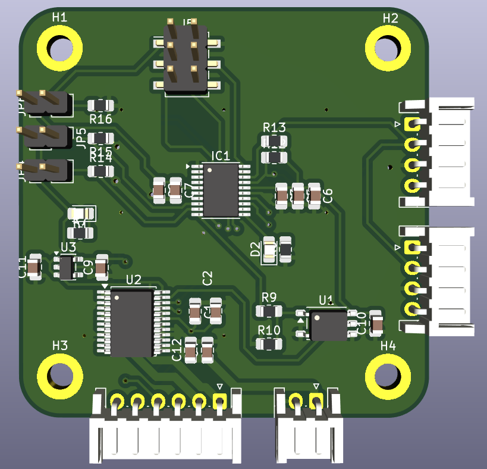

# PCB Esclave

## Description
Voici le PCB Esclave qui a pour but de gérer la commande des moteurs DC.

## Fonctionnement
### Etape 1
Le PCB Maître communique un octet avec le PCB Esclave via I2C. 
En fonction de la combinaisons des jumpers, l'adresse I2C du PCB Esclave est différente plus de détails dans la section [Adressage I2C]().
### Etape 2
En fonction de l'octet reçu, le PCB Esclave sait s'il doit avancer ou reculer et la vitesse attendue.
